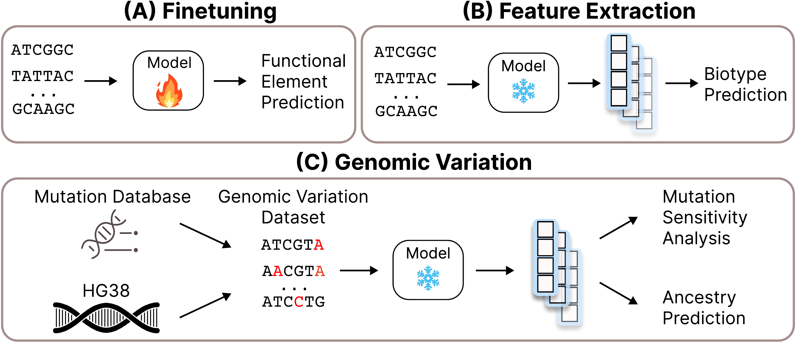

<div align="center">

# Genomic Foundationless Models: Pretraining Does Not Promise Performance

 [**Paper [bioRxiv]**](https://www.biorxiv.org/content/10.1101/2024.12.18.628606)

**Authors:** Kirill Vishniakov, Karthik Viswanathan, Aleksandr Medvedev, Praveenkumar Kanithi, Marco AF Pimentel, Ronnie Rajan, Shadab Khan


</div>

> **Abstract:** The success of Large Language Models has inspired the development of Genomic Foundation Models (GFMs) through similar pretraining techniques. However, the relationship between pretraining performance and effectiveness in downstream genomic tasks remains unclear. Additionally, the high computational cost of pretraining raises questions about its cost-efficiency. To assess the usefulness of pretraining in genomics, we evaluated seven different GFMs across various benchmarks, comparing them to their counterparts with randomly initialized weights. Surprisingly, we found that randomly initialized models can match or even surpass the performance of pretrained GFMs in finetuning and feature extraction tasks. We also discovered that pretrained GFMs fail to capture clinically relevant genetic mutations, which are crucial for understanding genetic disorders and phenotypic traits. Our results indicate that most of the current pretrained GFMs lack a ``foundational'' understanding of genomics and provide minimal utility, even for basic tasks such as sequence classification. These findings collectively highlight the need for critically rethinking the pretraining approaches for genomics.


## Getting Started

First, clone this repository and navigate to the project directory:

```bash
git clone https://github.com/m42-health/gfm-random-eval.git
cd gfm-random-eval
```

Set up the conda environment:

```bash
conda env create -f gfms_env.yaml
conda activate gfms_env
```

## How to Run


### NT Benchmark

#### Option 1: Single Script Run
Run a single model configuration directly:

```bash
python -m nt_benchmark.main_nt
```

You can reconfigure the script parameters by editing the `nt_benchmark/config.py` file.

#### Option 2: WANDB Sweep
1. Create a sweep using one of the sweep config files from `nt_benchmark/sweeps/` directory:

```bash
wandb sweep nt_benchmark/sweeps/hyenadna_all.yaml
```

2. Copy SWEEP_ID into `nt_benchmark/run_sweep.sh`:

```bash
SWEEP_ID="<PLACE YOUR SWEEP ID HERE>"
```

3. Run the sweep using the script:

```bash
bash nt_benchmark/run_sweep.sh
```

### Biotype Benchmark

#### Option 1: Single Script Run
Run a single model configuration directly:

```bash
python -m biotype.main_biotype
```
You can reconfigure the script parameters by editing the `biotype/main_biotype.py` file.

#### Option 2: WANDB Sweep
1. Create a sweep using one of the sweep config files from `biotype/sweeps/` directory:

```bash
wandb sweep biotype/sweeps/biotype_sweep.yaml
```

2. Copy SWEEP_ID into `biotype/run_biotype_sweep.sh`:

```bash
SWEEP_ID="<PLACE YOUR SWEEP ID HERE>"
```

3. Run the sweep using the script:

```bash
bash biotype/run_biotype_sweep.sh
```

### Cosine Similarity

Download the TP53 files from this [link](https://huggingface.co/datasets/m42-health/tp53/tree/main).

1. Run the mutation sensitivity experiments:

```bash
python -m cosine_similarity.main_sensitivity --ref_genome_path <path_to_genome> --output_dir <output_directory>
```

2. Run the ClinVar pathogenic/benign variant analysis:

```bash
python -m cosine_similarity.main_clinvar --clinvar_file <path_to_clinvar_csv> --genome_file <path_to_genome> --tp53_fasta <path_to_tp53_fasta>
```

### Ancestry

To run the ancestry experiments use the following command:

```bash
python -m ancestry.main_ancestry
```
